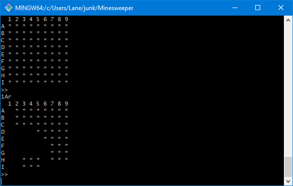
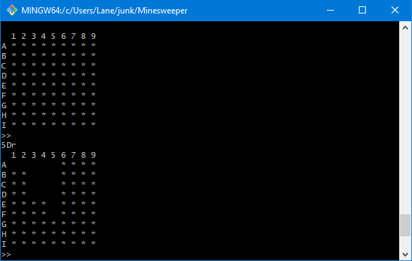
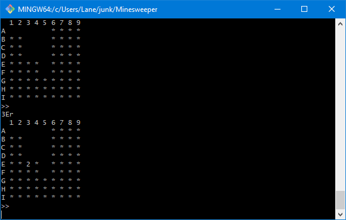

### Minesweeper

This repository houses a command-line version of the Minesweeper game, which now does not come preinstalled on Windows machines. 

Below are some screenshots of the game in action.

The path carved a revealed tile has no neighboring bombs. The command used here was "1Ar."


Another recursively carved path.



#### Setup

You can either run the compiled Java class files or the executable jar.

To run the jar, run 

```
$ cd path_to_installation/Minesweeper
$ java -jar minesweeper.jar
```

To run the compiled class files, run

```
$ cd path_to_installation/Minesweeper/bin
$ java net.lanesurface.minesweeper.Game
```

#### How to Play

The game takes a three character input string composed of a number, letter, and either "r" or "f" (in that order). The number is the column of the tile you want to modify, the (UPPERCASE) letter is the row. The last control character is whether you want to (r)eveal or (f)lag the tile you've chosen.

For example, `3Bf` would flag the tile in the 3rd column and 6th row.
